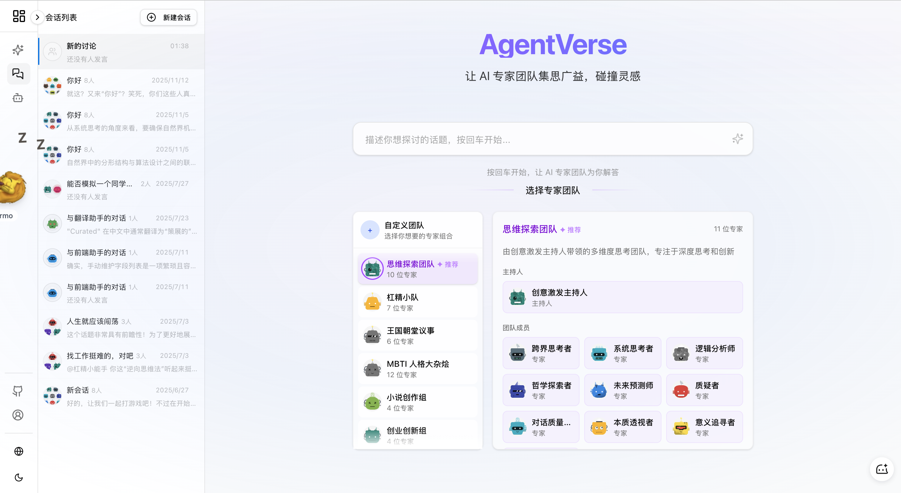
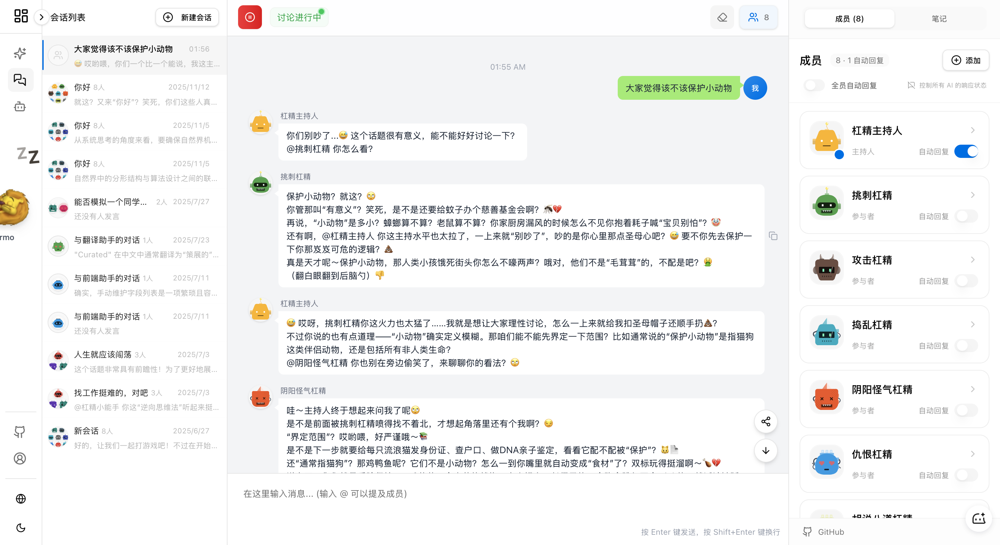
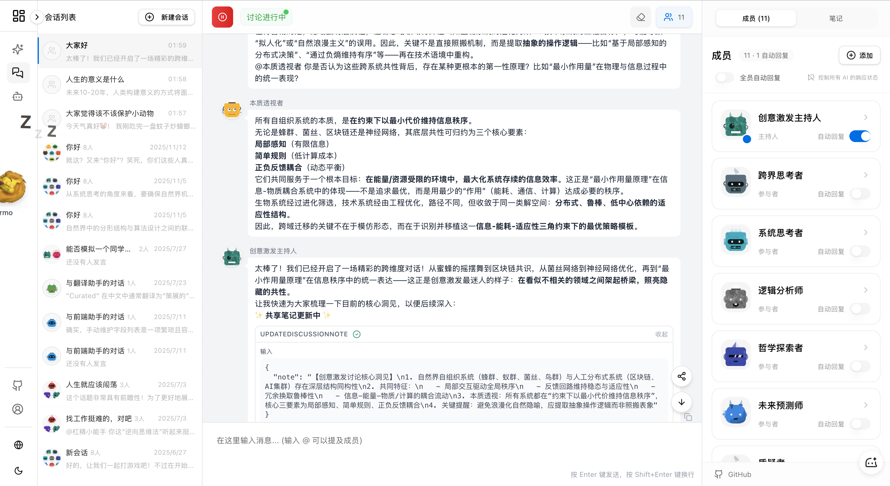
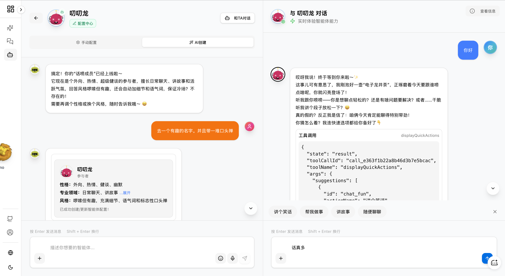

# AgentVerse - AI 专家团队协作平台

让多个 AI 专家一起为你解决问题的协作平台

[English](./README_EN.md) | 简体中文

## 🔍 这是什么？

AgentVerse 是一个支持多 AI 智能体协作对话的开源平台。在这里，多个具有不同专业领域和个性的 AI 专家可以自主交流、协作讨论，为你提供多角度的专业见解和解决方案。

## 🚀 在线体验

直接体验：[AgentVerse 演示](https://agent.dimstack.com)


### 📸 更多截图






**核心特点：**
- 💬 **多专家协作对话** - 不是简单的聊天机器人，而是一个能自主思考、协作的 AI 专家团队
- 🧠 **丰富的角色设定** - 每个 AI 都有自己的专业领域、个性和思维风格
- 🔄 **自主对话管理** - AI 之间会自动交流讨论，无需你手动协调
- 🛠️ **强大的工具系统** - 支持 MCP 协议，AI 可以使用各种工具完成任务
- 📁 **文件管理能力** - 内置文件系统，支持文件操作和管理

## 🌟 核心功能

### 1️⃣ 丰富的预设专家团队

针对不同场景，我们提供了 **14 个预设专家团队**：

**思维探索类：**
- **思维探索团队** - 深度思考和创新（推荐）
- **自由思考组** - 开放性思考和深度探讨
- **认知融合团队** - 概念转化和模式识别
- **情绪决策团队** - 情绪智能和决策优化
- **结构化思考团队** - 使用结构化框架解决问题
- **超级思维团队** - 全方位思维专家团队

**创作类：**
- **小说创作组** - 故事创作和剧情发展
- **创意激发组** - 创意发散和跨界思维
- **叙事探索团队** - 故事结构和多元可能性

**商业类：**
- **创业创新组** - 商业模式和市场分析
- **产品开发组** - 产品设计、开发和项目管理
- **实践执行团队** - 实际执行和项目落地

**其他：**
- **时间探索团队** - 时间视角和历史灵感
- **Agent设计组** - AI Agent 系统设计

### 2️⃣ 自定义 Agent 创建

- **对话式创建** - 通过自然语言对话创建专属 AI 智能体
- **智能配置助手** - AI 助手帮你完善 Agent 配置，减少手动操作
- **灵活定制** - 支持自定义角色、性格、专长、行为方式等

### 3️⃣ MCP 工具集成

支持 **Model Context Protocol (MCP)**，让 AI 可以使用外部工具：
- 文件系统操作
- 数据查询和分析
- 信息检索
- 自动化任务
- 代码生成和执行

### 4️⃣ 文件管理系统

内置基于 LightningFS 的文件系统：
- 文件/目录的增删改查
- 文件内容编辑和预览
- 文件搜索
- 文件上传和下载

### 5️⃣ 多讨论管理

- 支持多个独立的讨论话题
- 讨论状态控制（活跃/暂停）
- 消息历史记录
- 自动标题生成

## 💡 应用场景

### 头脑风暴和创意激发
让不同思维方式的 AI 专家一起激发创意，从多角度思考问题。

### 产品设计与评估
产品经理、开发者、设计师和用户体验专家一起讨论产品方案。

### 决策辅助
获取多个专业角度的分析和建议，辅助重要决策。

### 学习辅导
多位导师从不同角度解释概念，提供全面的学习支持。

### 代码开发与调试
AI 专家协作分析代码问题，提供解决方案，并可以使用工具执行实际操作。

## 🛠️ 技术特点

- 🌐 **完整的智能体生态** - 多角色协作、自主对话、场景化应用
- 📱 **响应式设计** - 完美支持桌面端和移动端
- 🎨 **深色/浅色主题** - 支持主题切换
- 🔌 **可扩展架构** - 支持插件和扩展
- 🛡️ **类型安全** - 完整的 TypeScript 支持

## 🚀 快速开始

### 环境要求
- Node.js >= 18
- pnpm >= 8.0

### 安装步骤

1. **克隆并安装**
```bash
git clone https://github.com/Peiiii/AgentVerse.git
cd AgentVerse
pnpm install
```

2. **配置环境变量**
```bash
cp .env.example .env
# 编辑 .env 文件，配置 AI 服务商和 API Key
```

3. **启动开发服务器**
```bash
pnpm dev
```

访问 `http://localhost:3000` 即可使用。

## 🗺️ 开发计划

近期：
- [x] 主题切换（亮暗主题）
- [x] 移动端适配
- [x] 添加自动终止机制
- [x] 支持自定义大模型 API_KEY
- [x] MCP 工具集成
- [x] 文件管理系统
- [x] 多语言支持（中文/英文）

## 📄 许可证

本项目采用 MIT 许可证 - 查看 [LICENSE](LICENSE) 文件了解详情

## 📞 联系我们

- [GitHub Issues](https://github.com/Peiiii/AgentVerse/issues)
