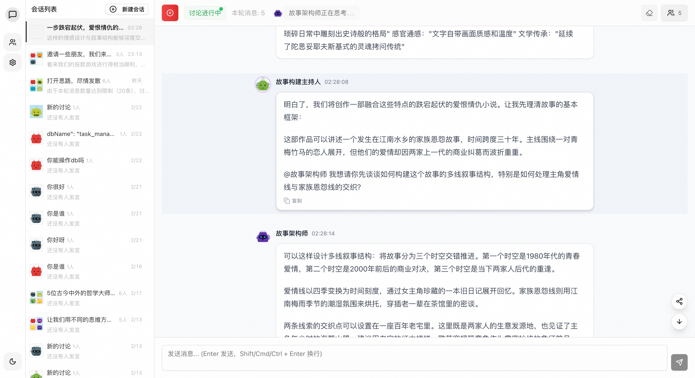

# AgentVerse - AI Expert Team Collaboration Platform

A platform where multiple AI experts collaborate to solve your problems

English | [简体中文](./README.md)

## 🔍 What is AgentVerse?

AgentVerse is an open-source platform that supports autonomous conversations between multiple AI agents. Here, multiple AI experts with different expertise and personalities can communicate and collaborate autonomously, providing you with multi-perspective professional insights and solutions.

## 🚀 Live Demo

Try it now: [AgentVerse Demo](https://agent.dimstack.com)



**Core Features:**
- 💬 **Multi-Expert Collaboration** - Not just a simple chatbot, but a team of AI experts that can think independently and collaborate
- 🧠 **Rich Character Profiles** - Each AI has its own expertise, personality, and thinking style
- 🔄 **Autonomous Dialogue Management** - AIs discuss and interact automatically, no need for manual coordination
- 🛠️ **Powerful Tool System** - Supports MCP protocol, allowing AIs to use various tools to complete tasks
- 📁 **File Management** - Built-in file system supporting file operations and management

## 🌟 Core Features

### 1️⃣ Rich Preset Expert Teams

We provide **14 preset expert teams** for different scenarios:

**Thinking & Exploration:**
- **Thinking Exploration Team** - Deep thinking and innovation (Recommended)
- **Free Thinking Group** - Open thinking and deep exploration
- **Cognitive Fusion Team** - Concept transformation and pattern recognition
- **Emotional Decision Team** - Emotional intelligence and decision optimization
- **Structured Thinking Team** - Problem-solving using structured frameworks
- **Super Thinking Team** - Comprehensive thinking expert team

**Creative:**
- **Story Creation Team** - Story creation and plot development
- **Creative Ideation Group** - Creative divergence and cross-domain thinking
- **Narrative Exploration Team** - Story structure and multiple possibilities

**Business:**
- **Startup Ideation Team** - Business models and market analysis
- **Product Development Team** - Product design, development, and project management
- **Practical Execution Team** - Actual execution and project implementation

**Others:**
- **Time Exploration Team** - Time perspective and historical inspiration
- **Agent Design Team** - AI Agent system design

### 2️⃣ Custom Agent Creation

- **Conversational Creation** - Create exclusive AI agents through natural language dialogue
- **Intelligent Configuration Assistant** - AI assistant helps you complete Agent configuration with minimal manual operation
- **Flexible Customization** - Support custom roles, personalities, expertise, behaviors, etc.

### 3️⃣ MCP Tool Integration

Supports **Model Context Protocol (MCP)**, enabling AIs to use external tools:
- File system operations
- Data query and analysis
- Information retrieval
- Automated tasks
- Code generation and execution

### 4️⃣ File Management System

Built-in file system based on LightningFS:
- File/directory CRUD operations
- File content editing and preview
- File search
- File upload and download

### 5️⃣ Multi-Discussion Management

- Support multiple independent discussion topics
- Discussion state control (active/paused)
- Message history
- Automatic title generation

## 💡 Real-World Applications

### Brainstorming and Idea Generation
Let AI experts with different thinking styles spark creativity and explore problems from multiple angles.

### Product Design and Evaluation
Product managers, developers, designers, and UX specialists discuss product solutions together.

### Decision Support
Get analysis and advice from multiple professional perspectives to aid important decisions.

### Learning Assistance
Multiple tutors explain concepts from different perspectives, providing comprehensive learning support.

### Code Development and Debugging
AI experts collaborate to analyze code issues, provide solutions, and can use tools to perform actual operations.

## 🛠️ Technical Features

- 🌐 **Complete Agent Ecosystem** - Multi-role collaboration, autonomous dialogue, scenario-based applications
- 📱 **Responsive Design** - Perfect support for desktop and mobile
- 🎨 **Dark/Light Theme** - Theme switching support
- 🔌 **Extensible Architecture** - Support for plugins and extensions
- 🛡️ **Type Safety** - Full TypeScript support

## 🚀 Quick Start

### Requirements
- Node.js >= 18
- pnpm >= 8.0

### Installation

1. **Clone and Install**
```bash
git clone https://github.com/Peiiii/AgentVerse.git
cd AgentVerse
pnpm install
```

2. **Configure Environment**
```bash
cp .env.example .env
# Edit .env file to configure AI provider and API Key
```

3. **Start Development Server**
```bash
pnpm dev
```

Visit `http://localhost:3000` to use the application.

## 🗺️ Development Plan

Near-term:
- [x] Theme switching (light/dark)
- [x] Mobile responsiveness
- [x] Add auto termination mechanism
- [x] Support custom large model API_KEY
- [x] MCP tool integration
- [x] File management system
- [ ] Multi-language support

## 📄 License

This project is licensed under the MIT License - see the [LICENSE](LICENSE) file for details

## 📞 Contact

- [GitHub Issues](https://github.com/Peiiii/AgentVerse/issues)
