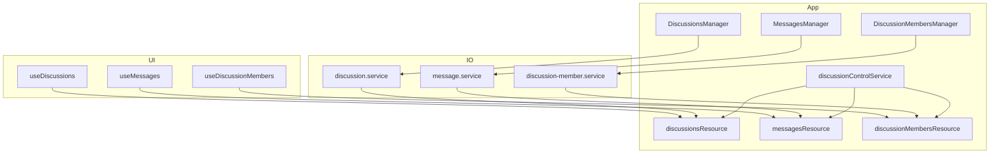

# Discussions/Messages/Members Architecture (Resource-first + Repository)

Status: Adopted

## Goals
- Remove double-caching between stores and resources
- Make queries pure-read; centralize write invalidation
- Keep a simple, predictable flow tied to `discussionControlService`

## Layers
- Service: `discussion.service.ts`, `message.service.ts`, `discussion-member.service.ts`
  - CRUD only; no caching; no UI concerns.
- Resource: `discussionsResource`, `messagesResource`, `discussionMembersResource` in `src/core/resources/index.ts`
  - list/current discussions; current messages; current members
  - Pure read; subscribe to `discussionControlService.onCurrentDiscussionIdChange$` to auto-reload current-scoped resources.
- Repository (Managers): `DiscussionsManager`, `MessagesManager`, `DiscussionMembersManager`
  - Thin write facades: call Service then `resource.reload()`; no local store.
  - Read helpers fetch from resource state (`getState()`), avoiding Suspense throw.
- Hooks: `useDiscussions()`, `useMessages()`, `useDiscussionMembers()`
  - Consume Resource via `useResourceState`.
  - Export data/isLoading/error (+ helpers like `addMessage`).
- Control: `discussionControlService`
  - Tracks current discussion id; emits changes to resources.

## Data Flow
1. App start: `PresenterProvider` bootstraps and calls `presenter.discussions.load()` which reloads `discussionsResource.list`.
2. Selecting a discussion: `DiscussionsManager.select(id)` -> `discussionControlService.setCurrentDiscussionId(id)` -> resources subscribed to the change reload their data.
3. Writes: Manager -> Service -> `resource.reload()` -> hooks update.

## Removed
- Zustand stores for discussions/messages/members have been deleted to avoid drift.

## Migration Notes
- UI should use hooks instead of `presenter.*.store((s)=>...)`.
- If an immediate value is needed within an effect without triggering Suspense, use resource `getState()`.

## Diagram

